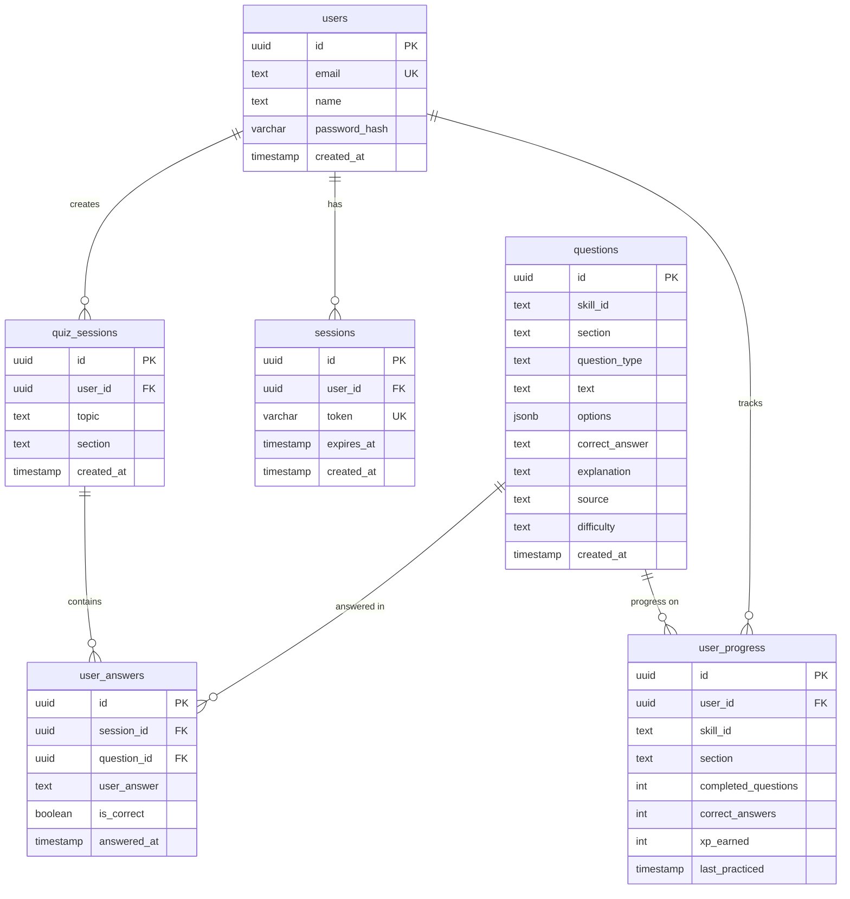

# Database Design and Optimization Plan

## Current Schema Analysis

### Existing Tables

#### users
```sql
CREATE TABLE users (
    id UUID PRIMARY KEY DEFAULT gen_random_uuid(),
    email TEXT UNIQUE NOT NULL,
    name TEXT,
    created_at TIMESTAMP WITH TIME ZONE DEFAULT NOW()
);
```

#### quiz_sessions
```sql
CREATE TABLE quiz_sessions (
    id TEXT PRIMARY KEY,  -- Inconsistent with users.id (UUID)
    user_id UUID REFERENCES users(id),
    topic TEXT NOT NULL,
    section TEXT NOT NULL,
    created_at TIMESTAMP WITH TIME ZONE DEFAULT NOW()
);
```

#### questions
```sql
CREATE TABLE questions (
    id TEXT PRIMARY KEY,  -- Inconsistent data type
    skill_id TEXT NOT NULL,
    section TEXT NOT NULL,
    question_type TEXT,
    text TEXT NOT NULL,
    options JSONB NOT NULL,
    correct_answer TEXT NOT NULL,
    explanation TEXT,
    source TEXT DEFAULT 'ai',
    difficulty TEXT DEFAULT 'medium',
    created_at TIMESTAMP WITH TIME ZONE DEFAULT NOW()
);
```

### Issues Identified

1. **Missing Tables**: No `user_answers`, `user_progress`, `xp_ledger`, `leaderboard_entries` tables
2. **Data Type Inconsistencies**: `quiz_sessions.id` and `questions.id` use TEXT instead of UUID
3. **Missing Indexes**: No indexes on foreign keys or frequently queried columns
4. **No Constraints**: No check constraints for enum values (section, difficulty, etc.)
5. **No User Progress Tracking**: No comprehensive XP, levels, streaks, leaderboard system
6. **No Migration Versioning**: Simple migration system without rollback capability
7. **No Quality Tracking**: No automated question quality scoring
8. **No Vector Search**: No semantic search capabilities
9. **No Spaced Repetition**: No error jail system
10. **Performance**: No optimization for expected query patterns

## Proposed Schema Improvements

### Core Gamification Tables

#### xp_ledger
```sql
CREATE TABLE xp_ledger (
    id UUID PRIMARY KEY DEFAULT gen_random_uuid(),
    user_id UUID NOT NULL REFERENCES users(id) ON DELETE CASCADE,
    amount INTEGER NOT NULL,
    reason TEXT NOT NULL,
    metadata JSONB,
    created_at TIMESTAMP WITH TIME ZONE DEFAULT NOW()
);
CREATE INDEX idx_xp_ledger_user_id ON xp_ledger(user_id);
```

#### leaderboard_entries
```sql
CREATE TABLE leaderboard_entries (
    id UUID PRIMARY KEY DEFAULT gen_random_uuid(),
    user_id UUID NOT NULL REFERENCES users(id) ON DELETE CASCADE,
    user_name TEXT,
    avatar TEXT,
    total_xp INTEGER DEFAULT 0,
    total_quizzes INTEGER DEFAULT 0,
    current_streak INTEGER DEFAULT 0,
    best_streak INTEGER DEFAULT 0,
    level INTEGER DEFAULT 1,
    updated_at TIMESTAMP WITH TIME ZONE DEFAULT NOW()
);
CREATE UNIQUE INDEX idx_leaderboard_user_id ON leaderboard_entries(user_id);
```

#### profiles
```sql
CREATE TABLE profiles (
    id UUID PRIMARY KEY REFERENCES users(id) ON DELETE CASCADE,
    username TEXT,
    xp INTEGER DEFAULT 0,
    level INTEGER DEFAULT 1,
    current_streak INTEGER DEFAULT 0,
    longest_streak INTEGER DEFAULT 0,
    last_active_date TIMESTAMP WITH TIME ZONE,
    total_quizzes INTEGER DEFAULT 0,
    total_questions INTEGER DEFAULT 0,
    total_correct INTEGER DEFAULT 0,
    skill_stats JSONB,
    metadata JSONB,
    updated_at TIMESTAMP WITH TIME ZONE DEFAULT NOW()
);
```

### Enhanced Question System

#### question_bank (enhanced)
```sql
-- Enable pgvector extension first
CREATE EXTENSION IF NOT EXISTS vector;

ALTER TABLE questions ADD COLUMN embedding VECTOR(1536);  -- OpenAI text-embedding-3-small
ALTER TABLE questions ADD COLUMN quality_score DECIMAL(4,3) DEFAULT 0.5;
ALTER TABLE questions ADD COLUMN times_served INTEGER DEFAULT 0;
ALTER TABLE questions ADD COLUMN correct_count INTEGER DEFAULT 0;
ALTER TABLE questions ADD COLUMN avg_response_ms INTEGER;
ALTER TABLE questions ADD COLUMN report_count INTEGER DEFAULT 0;
ALTER TABLE questions ADD COLUMN skip_count INTEGER DEFAULT 0;
ALTER TABLE questions ADD COLUMN content_hash TEXT;
ALTER TABLE questions ADD COLUMN is_verified BOOLEAN DEFAULT FALSE;
ALTER TABLE questions ADD COLUMN difficulty_level TEXT CHECK (difficulty_level IN ('easy', 'medium', 'hard'));
ALTER TABLE questions ADD COLUMN updated_at TIMESTAMP WITH TIME ZONE DEFAULT NOW();
```

#### question_usage
```sql
CREATE TABLE question_usage (
    user_id UUID NOT NULL REFERENCES users(id) ON DELETE CASCADE,
    question_id TEXT NOT NULL,  -- Will be UUID after migration
    skill_id TEXT,
    used_at TIMESTAMP WITH TIME ZONE DEFAULT NOW(),
    PRIMARY KEY (user_id, question_id)
);
CREATE INDEX idx_question_usage_user ON question_usage(user_id);
CREATE INDEX idx_question_usage_skill ON question_usage(skill_id);
```

### Answer and Progress Tracking

#### user_answers
```sql
CREATE TABLE user_answers (
    id UUID PRIMARY KEY DEFAULT gen_random_uuid(),
    session_id TEXT NOT NULL,  -- Will change to UUID
    question_id TEXT NOT NULL, -- Will change to UUID
    user_answer TEXT NOT NULL,
    is_correct BOOLEAN NOT NULL,
    response_time_ms INTEGER,
    answered_at TIMESTAMP WITH TIME ZONE DEFAULT NOW(),
    FOREIGN KEY (session_id) REFERENCES quiz_sessions(id) ON DELETE CASCADE
);
CREATE INDEX idx_user_answers_session ON user_answers(session_id);
CREATE INDEX idx_user_answers_question ON user_answers(question_id);
```

#### user_progress
```sql
CREATE TABLE user_progress (
    id UUID PRIMARY KEY DEFAULT gen_random_uuid(),
    user_id UUID REFERENCES users(id) ON DELETE CASCADE,
    skill_id TEXT NOT NULL,
    section TEXT NOT NULL,
    completed_questions INTEGER DEFAULT 0,
    correct_answers INTEGER DEFAULT 0,
    xp_earned INTEGER DEFAULT 0,
    last_practiced TIMESTAMP WITH TIME ZONE DEFAULT NOW(),
    UNIQUE(user_id, skill_id, section)
);
CREATE INDEX idx_user_progress_user ON user_progress(user_id);
CREATE INDEX idx_user_progress_skill_section ON user_progress(skill_id, section);
```

### Spaced Repetition System

#### error_jail
```sql
CREATE TABLE error_jail (
    id UUID PRIMARY KEY DEFAULT gen_random_uuid(),
    user_id UUID NOT NULL REFERENCES users(id) ON DELETE CASCADE,
    question_id TEXT NOT NULL,  -- Will be UUID after migration

    -- SRS Metadata
    next_review_at TIMESTAMP WITH TIME ZONE NOT NULL DEFAULT NOW(),
    interval_minutes INTEGER NOT NULL DEFAULT 0,
    ease_factor DECIMAL(4,3) NOT NULL DEFAULT 2.5,
    repetition INTEGER NOT NULL DEFAULT 0,
    times_answered_correctly INTEGER NOT NULL DEFAULT 0,

    -- Context Metadata
    skill_id TEXT NOT NULL,
    skill_name TEXT NOT NULL,
    section TEXT NOT NULL,
    original_quiz_id TEXT,

    jailed_at TIMESTAMP WITH TIME ZONE DEFAULT NOW(),
    last_attempt_at TIMESTAMP WITH TIME ZONE DEFAULT NOW(),

    UNIQUE(user_id, question_id)
);
CREATE INDEX idx_error_jail_user_next_review ON error_jail(user_id, next_review_at);
```

### Quiz History

#### quiz_history
```sql
CREATE TABLE quiz_history (
    id UUID PRIMARY KEY DEFAULT gen_random_uuid(),
    user_id UUID NOT NULL REFERENCES users(id) ON DELETE CASCADE,
    quiz_date TIMESTAMP WITH TIME ZONE NOT NULL,
    skill_id TEXT NOT NULL,
    skill_name TEXT NOT NULL,
    section TEXT NOT NULL,
    score INTEGER NOT NULL DEFAULT 0,
    total_questions INTEGER NOT NULL DEFAULT 0,
    xp_earned INTEGER NOT NULL DEFAULT 0,
    questions JSONB NOT NULL DEFAULT '[]'::jsonb,
    created_at TIMESTAMP WITH TIME ZONE NOT NULL DEFAULT NOW()
);
CREATE INDEX idx_quiz_history_user_id ON quiz_history(user_id);
CREATE INDEX idx_quiz_history_user_date ON quiz_history(user_id, quiz_date DESC);
```

### Authentication

#### sessions
```sql
CREATE TABLE sessions (
    id UUID PRIMARY KEY DEFAULT gen_random_uuid(),
    user_id UUID REFERENCES users(id) ON DELETE CASCADE,
    token VARCHAR(255) UNIQUE NOT NULL,
    expires_at TIMESTAMP WITH TIME ZONE NOT NULL,
    created_at TIMESTAMP WITH TIME ZONE DEFAULT NOW()
);
CREATE INDEX idx_sessions_user_id ON sessions(user_id);
CREATE INDEX idx_sessions_token ON sessions(token);
CREATE INDEX idx_sessions_expires_at ON sessions(expires_at);
```

### Schema Modifications

#### Update users table
```sql
ALTER TABLE users ADD COLUMN password_hash VARCHAR(255);
```

#### Update quiz_sessions table
```sql
-- Change id to UUID (requires data migration)
ALTER TABLE quiz_sessions ALTER COLUMN id TYPE UUID USING gen_random_uuid();
```

#### Update questions table
```sql
-- Change id to UUID
ALTER TABLE questions ALTER COLUMN id TYPE UUID USING gen_random_uuid();
```

### Indexes and Constraints

```sql
-- Foreign key indexes
CREATE INDEX idx_quiz_sessions_user_id ON quiz_sessions(user_id);
CREATE INDEX idx_user_answers_session_id ON user_answers(session_id);
CREATE INDEX idx_user_answers_question_id ON user_answers(question_id);
CREATE INDEX idx_user_progress_user_id ON user_progress(user_id);
CREATE INDEX idx_sessions_user_id ON sessions(user_id);
CREATE INDEX idx_sessions_token ON sessions(token);
CREATE INDEX idx_sessions_expires_at ON sessions(expires_at);

-- Query optimization indexes
CREATE INDEX idx_questions_skill_id ON questions(skill_id);
CREATE INDEX idx_questions_section ON questions(section);
CREATE INDEX idx_questions_difficulty ON questions(difficulty);
CREATE INDEX idx_user_progress_skill_section ON user_progress(skill_id, section);

-- Check constraints
ALTER TABLE questions ADD CONSTRAINT chk_section CHECK (section IN ('STRUCTURE', 'LISTENING', 'READING', 'SPEAKING'));
ALTER TABLE questions ADD CONSTRAINT chk_difficulty CHECK (difficulty IN ('easy', 'medium', 'hard'));
ALTER TABLE quiz_sessions ADD CONSTRAINT chk_session_section CHECK (section IN ('STRUCTURE', 'LISTENING', 'READING', 'SPEAKING'));
```

## Migration Strategy

### Phase 1: Add New Tables and Columns
```sql
-- Add password_hash to users
ALTER TABLE users ADD COLUMN password_hash VARCHAR(255);

-- Create sessions table
CREATE TABLE sessions (...);

-- Create user_progress table
CREATE TABLE user_progress (...);

-- Create user_answers table (after ID type changes)
```

### Phase 2: Data Type Migration
```sql
-- Backup data
CREATE TABLE quiz_sessions_backup AS SELECT * FROM quiz_sessions;
CREATE TABLE questions_backup AS SELECT * FROM questions;

-- Update data types (PostgreSQL handles this gracefully)
ALTER TABLE quiz_sessions ALTER COLUMN id TYPE UUID USING gen_random_uuid();
ALTER TABLE questions ALTER COLUMN id TYPE UUID USING gen_random_uuid();
```

### Phase 3: Add Constraints and Indexes
```sql
-- Add all constraints and indexes
-- This should be done after data migration to avoid conflicts
```

## Performance Optimizations

### Query Patterns Analysis
1. **Quiz Session Creation**: INSERT into quiz_sessions
2. **Question Retrieval**: SELECT by skill_id, section, excluding used questions
3. **Answer Recording**: INSERT into user_answers
4. **Progress Updates**: UPDATE user_progress
5. **User Stats**: Aggregate queries on user_progress and user_answers

### Recommended Indexes
- Composite indexes for complex queries
- Partial indexes for active sessions
- GIN indexes for JSONB options if needed

### Connection Pooling
Update database config for better connection pooling:
```go
config.MaxConns = 10
config.MinConns = 2
config.MaxConnLifetime = time.Hour
```

## ER Diagram



## Implementation Plan

1. **Backup Database**: Create full backup before changes
2. **Implement Migration System**: Add versioned migrations
3. **Phase 1 Migrations**: Add tables and columns
4. **Data Migration**: Update data types
5. **Phase 2 Migrations**: Add constraints and indexes
6. **Update Application Code**: Modify queries for new schema
7. **Testing**: Comprehensive testing of all database operations
8. **Performance Monitoring**: Monitor query performance post-migration

## Monitoring and Maintenance

- Set up query performance monitoring
- Regular index maintenance (REINDEX)
- Monitor table bloat and vacuum as needed
- Archive old quiz sessions if needed
- Implement database metrics collection